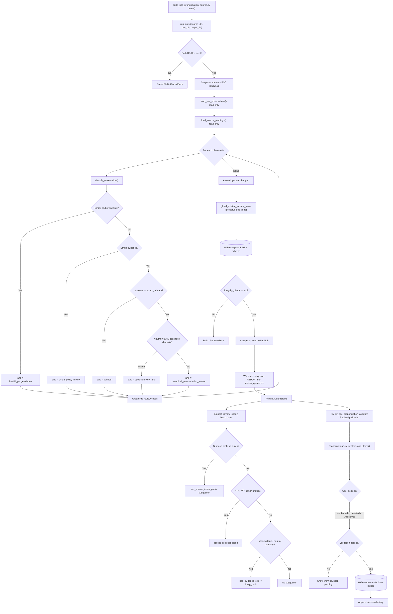

# PSC 来源材料转录校核与后续读音审计

## 当前任务：先校准来源转录

当前只进行第一阶段的“来源材料转录校核”：逐条确认录入数据库的汉字词形和拼音是否忠实于来源
材料。原型读音可以显示在旁边，帮助发现漏字、错字、错位、调号、分隔符和行列对应错误，但本阶段
不把原型当作裁判，也不因两边不一致而判定任何一边的读音事实错误。

第一阶段明确不处理以下问题：

- 轻声是否属于主读、次读、语境读音或独立读音；
- 来源材料中的读音是否应成为原型主读或高频读音；
- 原型现有读音的取舍、排序、增删、合并或拆分；
- 儿化表示政策、语流变调、本调还原和编码生成；
- 任何原型真源、Windows 候选库或输入法运行产物的修改。

只有先得到可信的来源转录层，后续读音审计才有稳定证据。不得在校正转录的同时顺手裁决读音政策，
也不得把“与原型不同”等同于“来源转录错误”。

## 数据边界

来源材料、转换文件及 PSC 对照数据库保留在外部目录，仓库不复制或再分发这些材料。当前工具只读：

- 外部 PSC 对照数据库；
- 原型 `.generated/lexicon_source_bundle/source_lexicon.sqlite3`；
- 生成的 `.generated/psc_pronunciation_audit/psc_pronunciation_audit.sqlite3`。

第一阶段决定单独写入：

```text
.generated/psc_pronunciation_audit/psc_transcription_review.sqlite3
```

该账本不与旧的读音裁决表混用。重新生成比较审计库不会删除转录校核记录；若同一来源记录的词形或
拼音发生变化，旧决定会显示为“来源记录已变化，需重校”，不会静默套用。

旧 `review_decisions` 和 `review_decision_history` 中已经形成的读音裁决及历史继续保留，但不在当前
第一阶段界面中显示为操作按钮，也不驱动任何原型修订。

## 实现流程图（维护导航）

下图概括比较审计、复核分流、原子写库及独立决策账本之间的关系。它用于帮助维护者定位代码，
不替代本文件规定的来源边界和人工裁决政策。



## 来源范围

当前转录层包含五类记录：

| 来源分组 | 第一阶段只核对 |
|---|---|
| 单/多音节注音表 | 词形、拼音、备选读音分隔及所在记录是否一致 |
| 轻声词表 | 词形和表中实际标注的拼音是否一致 |
| 儿化词表 | 词形、儿化拼写和分类位置是否一致 |
| 生僻字难点字词 | 单元格中的词形—拼音配对是否一致 |
| 短文语音提示 | 条目词形、拼音和篇目位置是否一致 |

“轻声词表”“儿化词表”等名称只说明来源分组，不代表本阶段已经接受其中任何读音政策。

## 生成比较索引

在原型根目录执行：

```powershell
.\venv312\Scripts\python.exe tools\audit_psc_pronunciation_source.py
```

默认 PSC 数据库为 `C:\dev\PSC-Outline\psc_outline_ocr.sqlite3`。生成目录还包含差异索引、输入指纹、
完整性计数和旧读音审计报告。它们在第一阶段只用于把较可能存在转录异常的记录排到前面，不构成读音
裁决。

## 运行第一阶段校核界面

在原型根目录双击或执行：

```powershell
.\Review-PSC-Audit.cmd
```

也可从任意目录执行：

```powershell
& "C:\dev\Yime-python-prototype\Review-PSC-Audit.cmd"
```

界面默认显示“参照差异（推荐）”，即两边存在形式差异、值得优先回看来源的记录；也可切换到“全部
来源记录”。原型参考区明确为只读参考，不提供“采纳 PSC”“保留原型”“两读并存”等读音裁决。

第一阶段只有三种决定：

- `转录正确`：当前词形和拼音与来源材料一致；
- `转录有误，已登记校正`：在界面中填写忠实于来源的词形和拼音；
- `暂时无法确认`：当前位置暂时看不清或定位信息不足，留待复核。

主表记录可在界面中显示带定位框的来源页片段；其他来源可点击“打开来源材料”，并按界面显示的页码、
源行或篇目位置核对。

## 只读和持久化门禁

实现必须保持以下不变量：

1. 运行校核、保存决定和撤销决定前后，PSC 对照数据库与原型真源数据库的内容哈希不变；
2. 转录决定及每次保存/撤销历史只写独立校核账本；
3. 比较审计库重建后，未变化记录的决定继续存在，已变化记录必须重新校核；
4. 第一阶段界面和批处理均不得生成原型读音修订或输入法编码修订。

自动化测试：

```powershell
.\venv312\Scripts\python.exe -m pytest -q tests\lexicon_bundle\test_psc_transcription_review.py
```

界面烟测使用带图像依赖的 Codex 内置 Python，并在启动后自动退出：

```powershell
& "$env:USERPROFILE\.cache\codex-runtimes\codex-primary-runtime\dependencies\python\python.exe" `
  .\tools\review_psc_pronunciation_audit.py --smoke-test
```

## 后续阶段（当前暂停）

来源转录层完成后，再另立“读音证据审计”任务。届时才讨论规范读音是否存在、词义分化、轻声与本调、
儿化、语境实现、频率排序以及原型修订。后续阶段必须消费已经校核的来源记录，并通过独立、显式、
可撤销的修订流程处理；不得回过头把第一阶段的“转录正确”解释成“应成为原型主读”。
