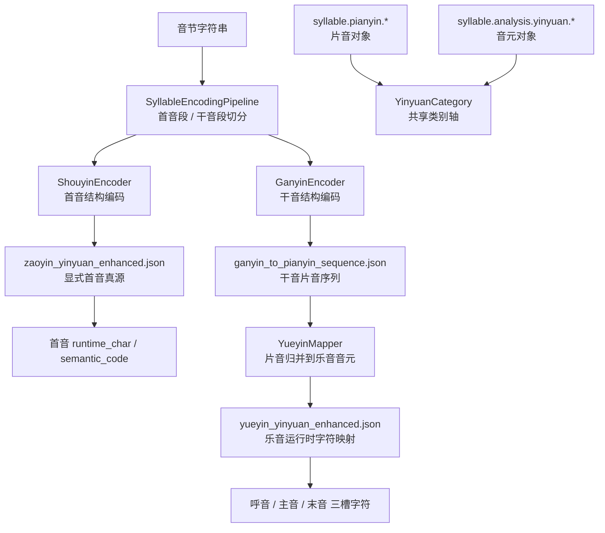

# 片音 / 音元重构流程

本文档说明 2026-06 这轮“噪音 / 乐音共享类别轴、片音到音元归并流程”重构后的主线。

## 目标

- 把 **噪音 / 乐音** 明确为跨层共享的类别轴，而不是某一层专有对象名。
- 把 **片音对象**、**音元对象**、**片音到音元的归并规则**、**编码表示** 四层拆开。
- 避免 `YueyinYinyuan` / `NoiseYinyuan` 同时兼任“领域对象 + 归并器 + 配置加载器 + 工具函数”。

## 重构后主线

## 分层约束

1. `syllable.pianyin.*`
负责片音对象。回答“这个实现值是什么”。

2. `syllable.analysis.yinyuan.*`
负责音元对象。回答“这个抽象单位是什么”。

3. `syllable.analysis.yueyin_mapper.YueyinMapper`
负责乐音片音到乐音音元的归并，以及数字/调号风格转换。回答“怎么从实现值归并到抽象单位”。

4. `syllable.analysis.ganyin_encoder.GanyinEncoder`
负责干音结构编码。它消费 mapper 与运行时映射，但不再把归并规则塞进 `YueyinYinyuan`。

5. `syllable.analysis.shouyin_encoder.ShouyinEncoder`
负责首音结构编码。当前主线从真源 JSON 直接读取显式映射，不再构造未参与主流程的 `NoiseYinyuan` 实例。

## 模块职责

| 模块 | 重构后职责 |
| --- | --- |
| `syllable.analysis.yinyuan_categories` | 共享 `zaoyin / yueyin` 类别轴 |
| `syllable.pianyin.pianyin` | 片音对象与共享 `category` 接口 |
| `syllable.analysis.yinyuan` | 音元对象与共享 `category` 接口 |
| `syllable.analysis.yueyin_yinyuan` | 乐音音元对象；仅保留对象语义与受控桥接 |
| `syllable.analysis.yueyin_mapper` | 乐音片音归并、双模型归并、调号样式转换 |
| `syllable.analysis.ganyin_encoder` | 干音结构编码主链 |
| `tools/syllable_analysis/*` | 统一复用 `YueyinMapper`，不再直接调用 `YueyinYinyuan` 私有方法 |

## 不再推荐的旧模式

- 在 `YueyinYinyuan` 上继续添加 `_process_mid_high_model`、`_change_pitch_style` 之类的流程方法。
- 让 `NoiseYinyuan` / `YueyinYinyuan` 同时兼任“领域对象”和“编码流程服务”。
- 把“噪音 / 乐音”写成只属于音元层、或只属于片音层的分类。
- 让 `UnpitchedPianyin` 默认投射成 `YueyinYinyuan`。

## 兼容性说明

- `type` 等历史字段保持兼容；新代码优先使用共享 `category` 轴。
- `YueyinYinyuan.from_pianyin()` 现在只接受乐音片音；噪音片音不再默认补成“中性调乐音音元”。
- 工具脚本已切到 `YueyinMapper`，主链与脚本链的归并规则保持同源。
