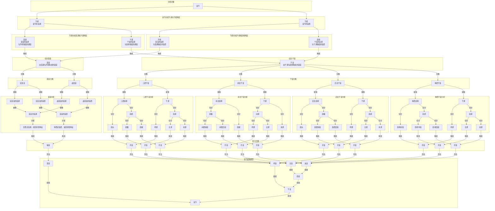

# 音元分析流程

## 音元分析流程描述

**开始**

- 音元分析开始

**音节分析**

- 音节被分析成音元序列

**首音与干音**

- 音节分成首音和干音两段
  - **首音**
    - 在未经音元分析时，首音是由首调与声母构成的音段
      - 声母是位处在音节中的首位辅音
      - 首调是与声母联结的调段
    - 在经过音元分析后，首音由噪音充当
  - **干音**
    - 在未经音元分析时，干音是由干调与韵母构成的音段
      - 韵母是位处在声母后的音质序列
      - 干调是与韵母联结的调段
    - 在经过音元分析后，干音由乐音构成

**首音分析**

- 首音分成实首音和虚首音两类。
- 无论是实首音还是虚首音，都可以进一步分析为音调和音质两个方面。
- 首音的音调表现为无稳定音调、非区别性特征；首音的音质表现为有稳定音质、是区别性特征。
- 因此，在音元分析中，首音由噪音充当。

**干音分析**

- 干音分成四类:
  - **三质干音**
    - 由干调与三质韵母构成
      - 三质韵母由韵头、韵腹和韵尾构成
      - 干调分成呼调、主调和末调
        - 呼调是与韵头联结的调段
        - 主调是与韵腹联结的调段
        - 末调是与韵尾联结的调段
      - 呼调与韵头构成呼音
      - 主调与韵腹构成主音
      - 末调与韵尾构成末音
    - 呼音、主音和末音构成三质干音
  - **前长干音**
    - 由干调与前长韵母构成
      - 前长韵母由韵腹和韵尾构成
      - 干调分成间调和末调
        - 间调是与韵腹联结的调段
        - 末调是与韵尾联结的调段
          - 韵腹分成呼质和主质（韵腹前段和韵腹后段）
          - 间调分成呼调和主调
            - 呼调是与韵腹前段联结的调段
            - 主调是与韵腹后段联结的调段
      - 呼调与呼质构成呼音
      - 主调与主质构成主音
      - 末调与韵尾构成末音
    - 呼音、主音和末音构成前长干音
  - **后长干音**
    - 由干调与后长韵母构成
      - 后长韵母由韵头和韵腹构成
      - 干调分成呼调和韵调
        - 呼调是与韵头联结的调段
        - 韵调是与韵腹联结的调段
          - 韵腹分成主质和末质（韵腹前段和韵腹后段）
          - 韵调分成主调和末调
            - 主调是与韵腹前段联结的调段
            - 末调是与韵腹后段联结的调段
      - 呼调与韵头构成呼音
      - 主调和主质构成主音
      - 末调和末质构成末音
    - 呼音、主音和末音构成后长干音
  - **单质干音**
    - 由干调与单质韵母构成
      - 单质韵母由韵腹充当
      - 干调是与韵母联结的调段
      - 韵母分成呼质、主质和末质（韵母前段、韵母中段和韵母后段）
      - 干调分成呼调、主调和末调
        - 呼调是与韵母前段联结的调段
        - 主调是与韵母中段联结的调段
        - 末调是与韵母后段联结的调段
      - 呼调与呼质构成呼音
      - 主调与主质构成主音
      - 末调与末质构成末音
    - 呼音、主音和末音构成单质干音

**结束**

- 音元分析结束

## 进一步说明

### 音元分析的基本思路

音元分析法是把一个音节分析为若干音元的方法。它的核心不是把音节只看作线性的“声母 + 韵母”，而是同时考察音节中的音调层和音质层，再把两层重新组合为能够承担结构功能的音段。

在这一分析框架中，音节先分成首音和干音两段。首音位于音节前部，由首调与声母构成。首调是与声母联结的调段，声母则是首音的音质部分。干音位于首音之后，由干调与韵母构成。干调是与韵母联结的调段，韵母则是干音的音质部分。

音元分为噪音和乐音两类。首音在音元层面由噪音充当，因为它的区别作用主要体现为稳定的音质，而不是稳定的音调。干音在音元层面由乐音构成，因为它会进一步分解为呼音、主音、末音等可参与韵律组织的单位。

### 四类干音的结构逻辑

干音按照韵母结构类型分为三质干音、前长干音、后长干音和单质干音四类。四类干音的差异，主要体现在韵母内部的结构划分方式不同，而与之相连的干调也会作相应切分。

三质干音由干调与三质韵母构成。三质韵母由韵头、韵腹和韵尾构成，因此干调与之对应地分为呼调、主调和末调三段。呼调与韵头构成呼音，主调与韵腹构成主音，末调与韵尾构成末音。

前长干音由干调与前长韵母构成。前长韵母由韵腹和韵尾构成，因此干调先分为间调和末调两段。间调与韵腹相对应，但为了和三分结构保持一致，间调还可以继续切分为呼调和主调；相应地，韵腹也切分为呼质和主质，于是前长干音最终仍可落实为呼音、主音和末音三个音元单位。

后长干音由干调与后长韵母构成。后长韵母由韵头和韵腹构成，因此干调先分为呼调和韵调两段。韵调对应韵腹，并可进一步切分为主调和末调；韵腹则进一步切分为主质和末质。这样，后长干音同样可以得到呼音、主音和末音三个层次明确的音元单位。

单质干音由干调与单质韵母构成。单质韵母整体上由韵腹充当，但在分析时可以按照前段、中段、后段来区分呼质、主质和末质。与之对应，干调也切分为呼调、主调和末调，因此单质干音最后也形成呼音、主音和末音三个音元。

### 中间层次的作用

为了把四类干音统一到同一套结构模型中，音元分析引入了“间音”和“韵音”这两个中间层次。前长干音中，间调与韵腹先构成间音，间音再分为呼音和主音。后长干音中，韵调与韵腹先构成韵音，韵音再分为主音和末音。借助这些中间层次，不同韵母结构的干音都可以在更高一层统一到“呼音 + 韵音”或“首音 + 干音”的层次上。

### 应用场景

音元分析法适合用于需要同时处理音节结构、音高组织和音质分布的任务。

- 在语音识别中，它可以把音节拆分为更细的结构单位，帮助系统区分首音、呼音、主音、末音在时序和声学特征上的不同表现。
- 在语音合成中，它有助于把音节内部的音调变化和音质变化分层处理，从而提高韵律控制与音节内部过渡的精细度。
- 在音系分析和教学描述中，它提供了一种比“声母 + 韵母 + 声调”更细致的表述方式，便于说明不同韵母类型之间的对应关系。

### 理论意义与发展方向

音元分析法的价值，在于它把音节看作一个分层结构，而不是一个不可分解的整体。通过把节调、节质、首音、干音、呼音、主音、末音等层次依次展开，可以更清楚地说明音节内部哪些部分承担区别功能，哪些部分承担组合功能，哪些部分只是结构上附着的调段。

后续如果继续扩展这一理论，可以沿着几个方向推进：一是补充不同韵母类型的实例分析，二是把音元分析与实际语音数据对应起来，三是进一步明确它与传统音系术语之间的映射关系。

### 音元分析流程

### 关键术语

1. **音节的两种基本分法**
  - 音节 = 首音 + 干音
  - 音节 = 节调 + 节质
  - 节调是音节的音调层。
  - 节质是音节的音质层。

2. **首音**
  - 首音 = 首调 + 声母
  - 首调是与声母联结的调段。
  - 声母是首音的音质部分。

3. **干音**
  - 干音 = 干调 + 韵母
  - 干调是与韵母联结的调段。
  - 韵母是干音的音质部分。

4. **四类干音**
  - 三质干音 = 干调 + 三质韵母
  - 前长干音 = 干调 + 前长韵母
  - 后长干音 = 干调 + 后长韵母
  - 单质干音 = 干调 + 单质韵母

5. **调段与音质段**
  - 呼调对应呼质。
  - 主调对应主质。
  - 末调对应末质。
  - 间调是前长干音中与韵腹联结的调段，可进一步分为呼调和主调。
  - 韵调是后长干音中与韵腹联结的调段，可进一步分为主调和末调。

6. **音元的构成**
  - 呼音 = 呼调 + 呼质
  - 主音 = 主调 + 主质
  - 末音 = 末调 + 末质
  - 在三质干音中，呼质、主质、末质分别对应韵头、韵腹、韵尾。
  - 在前长干音中，呼质和主质对应韵腹前后两段，末质对应韵尾。
  - 在后长干音中，呼质对应韵头，主质和末质对应韵腹前后两段。
  - 在单质干音中，呼质、主质、末质对应单质韵母的前段、中段、后段。

7. **中间层次与音节结构**
  - 韵音 = 主音 + 末音
  - 干音 = 呼音 + 韵音
  - 音节 = 首音 + 干音
  - 在前长干音中，还可以写作：间音 = 呼音 + 主音，音节 = 首音 + 间音 + 末音。
