# Yinyuan Analysis Process

## Description of the Yinyuan Analysis Process

**Start**

- The process of yinyuan analysis is initiated.

**Syllable Analysis**

- A syllable is analyzed as a sequence of yinyuan (phonetic variables).

**Initial Sound and Subsequent Sound**

- The syllable is divided into two major segments: the Initial Sound and the Subsequent Sound.
  - **Initial Sound**
    - Prior to yinyuan analysis, the Initial Sound is defined as the sound segment composed of the Initial Tonal Segment and the Initial Consonant.
      - The Initial Consonant is the consonantal element located at the beginning of the syllable.
      - The Initial Tonal Segment is the tonal segment associated with the Initial Consonant.
    - After yinyuan analysis, the Initial Sound is realized by Unpitched Sound.
  - **Subsequent Sound**
    - Prior to yinyuan analysis, the Subsequent Sound is defined as the sound segment composed of the Subsequent Tonal Segment and the Final.
      - The Final is the sequence of qualities that follows the Initial Consonant.
      - The Subsequent Tonal Segment is the tonal segment associated with the Final.
    - After yinyuan analysis, the Subsequent Sound is constituted by Pitched Sounds.

**Initial Sound Analysis**

- The Initial Sound is divided into two types: Substantial Initial Sound and Insubstantial Initial Sound.
- Whether substantial or insubstantial, the Initial Sound may be further analyzed in terms of pitch and quality.
- The pitch of the Initial Sound exhibits no stable pitch and therefore constitutes a non-distinctive feature, whereas the quality of the Initial Sound remains stable and functions as a distinctive feature.
- Accordingly, in yinyuan analysis, the Initial Sound is represented by Unpitched Sound.

**Subsequent Sound Analysis**

- The Subsequent Sound is divided into four types:
  - **Tri-Quality Subsequent Sound**
    - It consists of the Subsequent Tonal Segment and a Tri-Quality Final.
      - The Tri-Quality Final consists of a Medial, a Nucleus, and a Coda.
      - The Subsequent Tonal Segment is divided into the Second Pitch, the Main Pitch, and the Last Pitch.
        - The Second Pitch is the tonal segment associated with the Medial.
        - The Main Pitch is the tonal segment associated with the Nucleus.
        - The Last Pitch is the tonal segment associated with the Coda.
      - The Second Pitch and the Medial together form the Second Sound.
      - The Main Pitch and the Nucleus together form the Main Sound.
      - The Last Pitch and the Coda together form the Last Sound.
    - The Second Sound, the Main Sound, and the Last Sound together constitute the Tri-Quality Subsequent Sound.
  - **Front-Long Subsequent Sound**
    - It consists of the Subsequent Tonal Segment and a Front-Long Final.
      - The Front-Long Final consists of a Nucleus and a Coda.
      - The Subsequent Tonal Segment is divided into the Intermediate Pitch and the Last Pitch.
        - The Intermediate Pitch is the tonal segment associated with the Nucleus.
        - The Last Pitch is the tonal segment associated with the Coda.
          - The Nucleus is divided into the Second Quality and the Main Quality, that is, the anterior and posterior segments of the Nucleus.
          - The Intermediate Pitch is divided into the Second Pitch and the Main Pitch.
            - The Second Pitch is the tonal segment associated with the anterior segment of the Nucleus.
            - The Main Pitch is the tonal segment associated with the posterior segment of the Nucleus.
      - The Second Pitch and the Second Quality together form the Second Sound.
      - The Main Pitch and the Main Quality together form the Main Sound.
      - The Last Pitch and the Coda together form the Last Sound.
    - The Second Sound, the Main Sound, and the Last Sound together constitute the Front-Long Subsequent Sound.
  - **Back-Long Subsequent Sound**
    - It consists of the Subsequent Tonal Segment and a Back-Long Final.
      - The Back-Long Final consists of a Medial and a Nucleus.
      - The Subsequent Tonal Segment is divided into the Second Pitch and the Rime Pitch.
        - The Second Pitch is the tonal segment associated with the Medial.
        - The Rime Pitch is the tonal segment associated with the Nucleus.
          - The Nucleus is divided into the Main Quality and the Last Quality, that is, the anterior and posterior segments of the Nucleus.
          - The Rime Pitch is divided into the Main Pitch and the Last Pitch.
            - The Main Pitch is the tonal segment associated with the anterior segment of the Nucleus.
            - The Last Pitch is the tonal segment associated with the posterior segment of the Nucleus.
      - The Second Pitch and the Medial together form the Second Sound.
      - The Main Pitch and the Main Quality together form the Main Sound.
      - The Last Pitch and the Last Quality together form the Last Sound.
    - The Second Sound, the Main Sound, and the Last Sound together constitute the Back-Long Subsequent Sound.
  - **Single-Quality Subsequent Sound**
    - It consists of the Subsequent Tonal Segment and a Single-Quality Final.
      - The Single-Quality Final is filled by the Nucleus.
      - The Subsequent Tonal Segment is the tonal segment associated with the Final.
      - The Final is divided into the Second Quality, the Main Quality, and the Last Quality, that is, the anterior, middle, and posterior segments of the Final.
      - The Subsequent Tonal Segment is divided into the Second Pitch, the Main Pitch, and the Last Pitch.
        - The Second Pitch is the tonal segment associated with the anterior segment of the Final.
        - The Main Pitch is the tonal segment associated with the middle segment of the Final.
        - The Last Pitch is the tonal segment associated with the posterior segment of the Final.
      - The Second Pitch and the Second Quality together form the Second Sound.
      - The Main Pitch and the Main Quality together form the Main Sound.
      - The Last Pitch and the Last Quality together form the Last Sound.
    - The Second Sound, the Main Sound, and the Last Sound together constitute the Single-Quality Subsequent Sound.

**End**

- The process of yinyuan analysis is concluded.

## Further Explanation

### The Basic Idea of Yinyuan Analysis

Yinyuan analysis is a method by which a syllable is analyzed into a set of yinyuan. Its central premise is that the syllable should not be treated merely as a linear sequence of initial and final elements; rather, the tonal layer and the qualitative layer of the syllable are examined in parallel and subsequently recombined into sound segments with specific structural functions.

Within this framework, the syllable is first divided into the Initial Sound and the Subsequent Sound. The Initial Sound occupies the initial portion of the syllable and consists of the Initial Tonal Segment and the Initial Consonant. The Initial Tonal Segment is the tonal segment associated with the Initial Consonant, while the Initial Consonant constitutes the qualitative component of the Initial Sound. The Subsequent Sound follows the Initial Sound and consists of the Subsequent Tonal Segment and the Final. The Subsequent Tonal Segment is the tonal segment associated with the Final, while the Final constitutes the qualitative component of the Subsequent Sound.

Yinyuan are divided into two categories, namely Unpitched Sound and Pitched Sound. At the yinyuan level, the Initial Sound is realized as Unpitched Sound, because its distinctive function is primarily carried by stable quality rather than by stable pitch. The Subsequent Sound is realized as Pitched Sounds, because it may be further decomposed into the Second Sound, the Main Sound, and the Last Sound, all of which participate in the internal prosodic organization of the syllable.

### The Structural Logic of the Four Types of Subsequent Sound

The Subsequent Sound is divided into four types according to the structure of the Final: the Tri-Quality Subsequent Sound, the Front-Long Subsequent Sound, the Back-Long Subsequent Sound, and the Single-Quality Subsequent Sound. The principal difference among these four types lies in the internal segmentation of the Final, to which the connected Subsequent Tonal Segment is correspondingly adjusted.

The Tri-Quality Subsequent Sound consists of the Subsequent Tonal Segment and a Tri-Quality Final. Because the Tri-Quality Final consists of a Medial, a Nucleus, and a Coda, the connected Subsequent Tonal Segment is correspondingly divided into the Second Pitch, the Main Pitch, and the Last Pitch. These together yield the Second Sound, the Main Sound, and the Last Sound.

The Front-Long Subsequent Sound consists of the Subsequent Tonal Segment and a Front-Long Final. Because the Front-Long Final consists of a Nucleus and a Coda, the connected Subsequent Tonal Segment is first divided into the Intermediate Pitch and the Last Pitch. In order to preserve a three-part structural correspondence, the Intermediate Pitch may be further divided into the Second Pitch and the Main Pitch, while the Nucleus may be divided into the Second Quality and the Main Quality. The Front-Long Subsequent Sound is thus ultimately analyzed as the Second Sound, the Main Sound, and the Last Sound.

The Back-Long Subsequent Sound consists of the Subsequent Tonal Segment and a Back-Long Final. Because the Back-Long Final consists of a Medial and a Nucleus, the connected Subsequent Tonal Segment is first divided into the Second Pitch and the Rime Pitch. The Rime Pitch may then be further divided into the Main Pitch and the Last Pitch, while the Nucleus is further divided into the Main Quality and the Last Quality. Accordingly, the Back-Long Subsequent Sound is likewise analyzed as the Second Sound, the Main Sound, and the Last Sound.

The Single-Quality Subsequent Sound consists of the Subsequent Tonal Segment and a Single-Quality Final. Although the Single-Quality Final is realized by the Nucleus as a whole, it may still be analyzed into anterior, middle, and posterior segments, corresponding respectively to the Second Quality, the Main Quality, and the Last Quality. The connected Subsequent Tonal Segment is correspondingly divided into the Second Pitch, the Main Pitch, and the Last Pitch, and the Single-Quality Subsequent Sound is therefore likewise analyzed as the Second Sound, the Main Sound, and the Last Sound.

### The Role of Intermediate Layers

In order to accommodate the four types of Subsequent Sound within a unified structural model, yinyuan analysis introduces two intermediate layers: the Intermediate Sound and the Rime. In the Front-Long Subsequent Sound, the Intermediate Pitch and the Nucleus first form the Intermediate Sound, which is subsequently divided into the Second Sound and the Main Sound. In the Back-Long Subsequent Sound, the Rime Pitch and the Nucleus first form the Rime, which is subsequently divided into the Main Sound and the Last Sound. Through these intermediate layers, different final structures may be represented at a higher level in a unified manner, either as Second Sound plus Rime or as Initial Sound plus Subsequent Sound.

### Application Scenarios

Yinyuan analysis is particularly suitable for tasks that require the simultaneous treatment of syllable structure, pitch organization, and quality distribution.

- In speech recognition, it provides a means of decomposing the syllable into finer structural units, thereby enabling more precise distinctions among the Initial Sound, the Second Sound, the Main Sound, and the Last Sound with respect to timing and acoustic characteristics.
- In speech synthesis, it permits pitch variation and quality variation within the syllable to be processed in a layered manner, thereby improving prosodic control and the smoothness of internal transitions.
- In phonological analysis and pedagogical description, it provides a more fine-grained descriptive framework than the conventional model of initial, final, and tone, thereby facilitating the explanation of correspondences among different types of finals.

### Theoretical Significance and Future Directions

The theoretical significance of yinyuan analysis lies in its treatment of the syllable as a layered structure rather than as an indivisible whole. By unfolding, step by step, the levels of syllabic tone, syllabic quality, the Initial Sound, the Subsequent Sound, the Second Sound, the Main Sound, and the Last Sound, the model makes it possible to distinguish more clearly those components of the syllable that carry distinctive functions, those that carry combinatory functions, and those that function only as structurally attached tonal segments.

If the theory is to be further developed, several directions merit particular attention: the addition of more detailed analyses of different final types, the correlation of yinyuan analysis with actual phonetic data, and the clarification of its relationship to more traditional phonological terminology.

### Yinyuan Analysis Process

```mermaid
graph TB
  Start((Start)) --> |Input|A[Syllable]
  subgraph ExtractToneAndQuality["Extracting the tone and quality of the syllable"]
    A --> |Extract the tone of the syllable|B[Syllabic Tone<br>Tone of the Syllable]
    A --> |Extract the quality of the syllable|C[Syllabic Quality<br>Initial Consonant and Final]
  end

  subgraph DivideToneAndQuality["Dividing the tonal and qualitative layers"]
    subgraph DivideTone["Dividing the tonal layer"]
    B --> |Extract the tone of the Initial Sound<br>Extract the tonal segment connected to the Initial Consonant|D1[Initial Tonal Segment<br>Tonal segment connected to the Initial Consonant]
    B --> |Extract the tone of the Subsequent Sound<br>Extract the tonal segment connected to the Final|D2[Subsequent Tonal Segment<br>Tonal segment connected to the Final]
    end
    subgraph DivideQuality["Dividing the qualitative layer"]
    C --> |Extract the quality of the Initial Sound<br>Extract the Initial Consonant|E1[Initial Consonant<br>Quality of the Initial Sound]
    C --> |Extract the quality of the Subsequent Sound<br>Extract the Final|E2[Final<br>Quality of the Subsequent Sound]
    end
  end

  subgraph DivideInitialAndSubsequent["Dividing the Initial Sound and the Subsequent Sound"]
    subgraph DivideInitial["Dividing the Initial Sound"]
      D1 --> |Form|F[Initial Sound]
      E1 --> |Form|F
    end
    subgraph DivideSubsequent["Dividing the Subsequent Sound"]
      D2 --> |Form|G[Subsequent Sound]
      E2 --> |Form|G
    end
  end

  subgraph ClassifyInitialAndSubsequent["Classifying the Initial Sound and the Subsequent Sound"]
    F --> |Classify|F1{Does the Initial Sound have a distinctive function?}
    F1 --> |Yes|H1[Substantial Initial Sound]
    F1 --> |No|H2[Insubstantial Initial Sound]
    G --> |Classify|F2{What type of final structure does the Subsequent Sound have?}
    F2 --> |Tri-Quality Final|G1[Tri-Quality Subsequent Sound]
    F2 --> |Front-Long Final|G2[Front-Long Subsequent Sound]
    F2 --> |Back-Long Final|G3[Back-Long Subsequent Sound]
    F2 --> |Single-Quality Final|G4[Single-Quality Subsequent Sound]
  end

  subgraph AnalyzeInitialAndSubsequent["Analyzing the Initial Sound and the Subsequent Sound"]
    subgraph InitialAnalysis["Initial Sound Analysis"]
      H1 --> |Extract|H3[Pitch]
      H1 --> |Extract|H4[Quality]
      H2 --> |Extract|H5[Pitch]
      H2 --> |Extract|H6[Quality]
      H3 --> |Generalize as|H7[Pitch of the Initial Sound]
      H5 --> |Generalize as|H7
      H4 --> |Generalize as|H8[Quality of the Initial Sound]
      H6 --> |Generalize as|H8
      H7 --> |Analyze|H9[No stable pitch, non-distinctive feature]
      H8 --> |Analyze|H10[Stable quality, distinctive feature]
    end

    subgraph SubsequentAnalysis["Subsequent Sound Analysis"]
      subgraph SingleQualityAnalysis["Single-Quality Subsequent Sound Analysis"]
      G4 --> |Extract|J1[Subsequent Tonal Segment]
      G4 --> |Extract|J2[Single-Quality Final]
      J2 --> |Further analyze as|J3[Final Base<br>Final Body<br>Nucleus<br>Nuclear Core]
      J3 --> |Segment|J4[Anterior segment of the Final]
      J3 --> |Segment|J5[Middle segment of the Final]
      J3 --> |Segment|J6[Posterior segment of the Final]

      J1 --> |Transfer|J7[Subsequent Tonal Segment]
      J7 --> |Segment|J8[Second Pitch]
      J7 --> |Segment|J9[Main Pitch]
      J7 --> |Segment|J10[Last Pitch]
      end

      subgraph BackLongAnalysis["Back-Long Subsequent Sound Analysis"]
      G3 --> |Extract|K1[Subsequent Tonal Segment]
      G3 --> |Extract|K2[Back-Long Final]

      K2 --> |Segment|K3[Medial<br>Further analyzed as the head of the final]
      K2 --> |Segment|K4[Final Base<br>Final Body<br>Nucleus<br>Nuclear Core<br>Further analyzed as Rime Quality]
      K3 --> |Transfer|K5[Head of the Final]
      K4 --> |Segment|K6[Anterior segment of the Rime Quality<br>Anterior segment of the Nuclear Core]
      K4 --> |Segment|K7[Posterior segment of the Rime Quality<br>Posterior segment of the Nuclear Core]

      K1 --> |Segment|K8[Second Pitch]
      K1 --> |Segment|K9[Rime Pitch]
      K8 --> |Transfer|K10[Second Pitch]
      K9 --> |Segment|K11[Main Pitch]
      K9 --> |Segment|K12[Last Pitch]
      end

      subgraph FrontLongAnalysis["Front-Long Subsequent Sound Analysis"]
      G2 --> |Extract|L1[Subsequent Tonal Segment]
      G2 --> |Extract|L2[Front-Long Final<br>Further analyzed as Final Base or Final Body]

      L2 --> |Segment|L3[Nucleus<br>Nuclear Core<br>Further analyzed as Intermediate Quality]
      L2 --> |Segment|L4[Coda]
      L1 --> |Segment|L5[Intermediate Pitch]
      L1 --> |Segment|L6[Last Pitch]

      L3 --> |Segment|L7[Anterior segment of the Intermediate Quality<br>Anterior segment of the Nuclear Core]
      L3 --> |Segment|L8[Posterior segment of the Intermediate Quality<br>Posterior segment of the Nuclear Core]
      L4 --> |Transfer|L9[Coda]

      L5 --> |Segment|L10[Second Pitch]
      L5 --> |Segment|L11[Main Pitch]
      L6 --> |Transfer|L12[Last Pitch]
      end

      subgraph TriQualityAnalysis["Tri-Quality Subsequent Sound Analysis"]
      G1 --> |Extract|M1[Subsequent Tonal Segment]
      G1 --> |Extract|M2[Tri-Quality Final]

      M1 --> |Segment|M3[Second Pitch]
      M1 --> |Segment|M4[Rime Pitch]

      M3 --> |Transfer|M5[Second Pitch]
      M4 --> |Segment|M6[Main Pitch]
      M4 --> |Segment|M7[Last Pitch]

      M2 --> |Segment|M8[Medial]
      M2 --> |Segment|M9[Final Base<br>Final Body<br>Rime Quality]
      M8 --> |Further analyze as|M10[Head of the Final]
      M9 --> |Segment|M11[Nucleus<br>Nuclear Core]
      M9 --> |Segment|M12[Coda]
      end
    end
  end

  H9 --> |Abbreviate as|H11[Initial Tonal Segment]
  H10 --> |Abbreviate as|H12[Initial Quality]

  J8 --> |Transfer|J11[Second Pitch]
  J9 --> |Transfer|J12[Main Pitch]
  J10 --> |Transfer|J13[Last Pitch]
  J4 --> |Rename as|J14[Second Quality]
  J5 --> |Rename as|J15[Main Quality]
  J6 --> |Rename as|J16[Last Quality]

  K10 --> |Transfer|K13[Second Pitch]
  K11 --> |Transfer|K14[Main Pitch]
  K12 --> |Transfer|K15[Last Pitch]
  K5 --> |Rename as|K16[Second Quality]
  K6 --> |Rename as|K17[Main Quality]
  K7 --> |Rename as|K18[Last Quality]

  L10 --> |Transfer|L13[Second Pitch]
  L11 --> |Transfer|L14[Main Pitch]
  L12 --> |Transfer|L15[Last Pitch]
  L7 --> |Rename as|L16[Second Quality]
  L8 --> |Rename as|L17[Main Quality]
  L9 --> |Rename as|L18[Last Quality]

  M5 --> |Transfer|M13[Second Pitch]
  M6 --> |Transfer|M14[Main Pitch]
  M7 --> |Transfer|M15[Last Pitch]
  M10 --> |Rename as|M16[Second Quality]
  M11 --> |Rename as|M17[Main Quality]
  M12 --> |Rename as|M18[Last Quality]

  subgraph YinyuanAnalysis["Yinyuan Analysis"]
    subgraph UnpitchedAnalysis["Analysis of Unpitched Sound"]
      H11 --> |Form|N1[Unpitched Sound]
      H12 --> |Form|N1
    end
    subgraph PitchedAnalysis["Analysis of Pitched Sound"]
      J11 --> |Form|N2[Pitched Sound]
      J14 --> |Form|N2
      J12 --> |Form|N3[Pitched Sound]
      J15 --> |Form|N3
      J13 --> |Form|N4[Pitched Sound]
      J16 --> |Form|N4

      K13 --> |Form|O1[Pitched Sound]
      K16 --> |Form|O1
      K14 --> |Form|O2[Pitched Sound]
      K17 --> |Form|O2
      K15 --> |Form|O3[Pitched Sound]
      K18 --> |Form|O3

      L13 --> |Form|P1[Pitched Sound]
      L16 --> |Form|P1
      L14 --> |Form|P2[Pitched Sound]
      L17 --> |Form|P2
      L15 --> |Form|P3[Pitched Sound]
      L18 --> |Form|P3

      M13 --> |Form|Q1[Pitched Sound]
      M16 --> |Form|Q1
      M14 --> |Form|Q2[Pitched Sound]
      M17 --> |Form|Q2
      M15 --> |Form|Q3[Pitched Sound]
      M18 --> |Form|Q3
    end
  end

  subgraph SyllableStructureModel["Syllable Structure Model"]
    N1 --> |Fill the Initial Sound|R1[Initial Sound]
    N2 --> |Fill the Second Sound|R2[Second Sound]
    N3 --> |Fill the Main Sound|R3[Main Sound]
    N4 --> |Fill the Last Sound|R4[Last Sound]

    O1 --> |Fill the Second Sound|R2
    O2 --> |Fill the Main Sound|R3
    O3 --> |Fill the Last Sound|R4

    P1 --> |Fill the Second Sound|R2
    P2 --> |Fill the Main Sound|R3
    P3 --> |Fill the Last Sound|R4

    Q1 --> |Fill the Second Sound|R2
    Q2 --> |Fill the Main Sound|R3
    Q3 --> |Fill the Last Sound|R4

    R1 --> |Promote|S1[Initial Sound]
    R2 --> |Promote|S2[Second Sound]
    R3 --> |Combine into|S3[Rime]
    R4 --> |Combine into|S3

    S1 --> |Promote|T1[Initial Sound]
    S2 --> |Combine into|T2[Subsequent Sound]
    S3 --> |Combine into|T2

    T1 --> |Combine into|U1[Syllable]
    T2 --> |Combine into|U1
  end
  U1 --> |Output|End((End))
```

### Key Terms

1. **Two basic ways of dividing the syllable**
   - Syllable = Initial Sound + Subsequent Sound
   - Syllable = Syllabic Tone + Syllabic Quality
   - Syllabic Tone is the tonal layer of the syllable.
   - Syllabic Quality is the qualitative layer of the syllable.

2. **Initial Sound**
   - Initial Sound = Initial Tonal Segment + Initial Consonant
   - The Initial Tonal Segment is the tonal segment connected to the Initial Consonant.
   - The Initial Consonant is the qualitative part of the Initial Sound.

3. **Subsequent Sound**
   - Subsequent Sound = Subsequent Tonal Segment + Final
   - The Subsequent Tonal Segment is the tonal segment connected to the Final.
   - The Final is the qualitative part of the Subsequent Sound.

4. **The four types of Subsequent Sound**
   - Tri-Quality Subsequent Sound = Subsequent Tonal Segment + Tri-Quality Final
   - Front-Long Subsequent Sound = Subsequent Tonal Segment + Front-Long Final
   - Back-Long Subsequent Sound = Subsequent Tonal Segment + Back-Long Final
   - Single-Quality Subsequent Sound = Subsequent Tonal Segment + Single-Quality Final

5. **Tonal segments and qualitative segments**
   - The Second Pitch corresponds to the Second Quality.
   - The Main Pitch corresponds to the Main Quality.
   - The Last Pitch corresponds to the Last Quality.
   - The Intermediate Pitch is the tonal segment connected to the Nucleus in the Front-Long Subsequent Sound and can be further divided into the Second Pitch and the Main Pitch.
   - The Rime Pitch is the tonal segment connected to the Nucleus in the Back-Long Subsequent Sound and can be further divided into the Main Pitch and the Last Pitch.

6. **The composition of yinyuan**
   - Second Sound = Second Pitch + Second Quality
   - Main Sound = Main Pitch + Main Quality
   - Last Sound = Last Pitch + Last Quality
   - In the Tri-Quality Subsequent Sound, the Second Quality, the Main Quality, and the Last Quality correspond respectively to the Medial, the Nucleus, and the Coda.
   - In the Front-Long Subsequent Sound, the Second Quality and the Main Quality correspond to the anterior and posterior segments of the Nucleus, while the Last Quality corresponds to the Coda.
   - In the Back-Long Subsequent Sound, the Second Quality corresponds to the Medial, while the Main Quality and the Last Quality correspond to the anterior and posterior segments of the Nucleus.
   - In the Single-Quality Subsequent Sound, the Second Quality, the Main Quality, and the Last Quality correspond to the anterior, middle, and posterior segments of the Final.

7. **Intermediate layers and syllable structure**
   - Rime = Main Sound + Last Sound
   - Subsequent Sound = Second Sound + Rime
   - Syllable = Initial Sound + Subsequent Sound
   - In the Front-Long Subsequent Sound, one may also write: Intermediate Sound = Second Sound + Main Sound, and Syllable = Initial Sound + Intermediate Sound + Last Sound.
