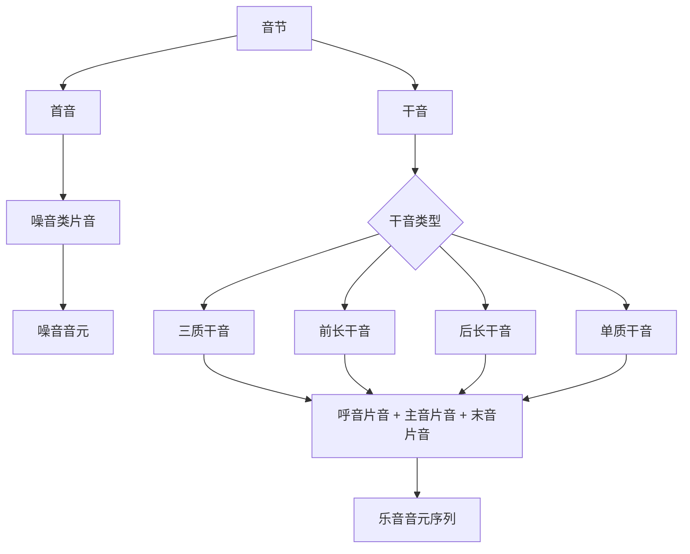

# 片音表示与音元映射

## 概念定位

在音元分析法中，音节并不直接被视为不可分解的整体，而是先分成首音与干音两段，再进一步落实为能够承担结构功能的分析单位。所谓片音，就是这一分析过程在表示层上的结果形式之一。它不是脱离音元分析法而独立成立的总括性“四特征单元”，而是首音或干音在完成结构切分之后、以可书写形式呈现出来的音段单位。

从分析顺序看，音节先分成节调与节质两层；节调再分成首调与干调，节质再分成声母与韵母；首调与声母构成首音，干调与韵母构成干音。首音经分析后由噪音充当，干音经分析后由乐音构成。片音正是这些噪音和乐音在表示层上的具体写法，因此它应当从属于音元分析法，而不宜另立为一套与首音、干音并行的理论框架。

## 片音的基本定义

片音是音元分析结果的表示单位，核心由音质与调段的组合关系决定。

- 噪音类片音对应首音分析的结果，其要点不在于稳定音高，而在于具有稳定音质。
- 乐音类片音对应干音分析的结果，由与某一音质部分相联结的调段和该音质部分共同构成。

因此，片音的基础分类应当与音元分析法保持一致，即分为噪音类片音与乐音类片音两类，而不是首先按音长、音强等附加参数来建构主干分类。

## 片音与音元的关系

片音与音元并非同一层次的对象。

- 片音是分析结果的表示形式，强调“某一音质部分与某一调段如何配对并写出”。
- 音元是进一步归一化后的结构单位，强调“该单位在系统中承担何种区别或组合功能”。

就处理次序而言，可以把片音理解为由分析结构通向音元编码或音元记写的一层中间表示。噪音类片音可对应首音层面的噪音音元，乐音类片音则可进一步对应呼音、主音、末音等位置上的乐音音元。因而，片音适合承担表示、转写、切分结果输出等任务，而音元更适合承担归类、编码、对照和结构比较等任务。

## 首音、干音与片音的对应关系

### 首音对应噪音类片音

在音元分析法中，首音由首调与声母构成。无论是实首音还是虚首音，继续分析后都表明：首音的音调不具有稳定音高，属于非区别性特征；首音的音质则相对稳定，承担区别作用。因此，首音在分析结果上由噪音充当。

落到片音表示层时，首音对应的是噪音类片音。此类片音的核心是对首音音质的标写，而不是对稳定调值的标写。换言之，首音进入片音层后，保留的是可区别的音质信息，而不是与乐音并列的完整调高结构。

### 干音对应乐音类片音序列

干音由干调与韵母构成。由于干音内部可以继续分析为呼音、主音、末音等结构单位，因此它在片音层上通常落实为一个由若干乐音类片音构成的序列，而不是单一不可再分的整块单位。

乐音类片音的形成原则是：某一调段与其所联结的音质部分共同构成一个可记写的片音。因此，呼调与呼质构成呼音片音，主调与主质构成主音片音，末调与末质构成末音片音。若中间层次存在，则先经由间音或韵音完成结构过渡，再落实到具体片音序列。

## 四类干音在片音层上的展开方式

音元分析法中的四类干音，在片音层上都以三位结构为归宿，只是到达这一三位结构的内部路径不同。

| 干音类型 | 质层结构 | 调层结构 | 片音层输出 |
| --- | --- | --- | --- |
| 三质干音 | 韵头 + 韵腹 + 韵尾 | 呼调 + 主调 + 末调 | 呼音片音 + 主音片音 + 末音片音 |
| 前长干音 | 呼质 + 主质 + 韵尾 | 呼调 + 主调 + 末调 | 呼音片音 + 主音片音 + 末音片音 |
| 后长干音 | 韵头 + 主质 + 末质 | 呼调 + 主调 + 末调 | 呼音片音 + 主音片音 + 末音片音 |
| 单质干音 | 呼质 + 主质 + 末质 | 呼调 + 主调 + 末调 | 呼音片音 + 主音片音 + 末音片音 |

其中需要特别说明的是前长干音与后长干音。

- 前长干音先表现为“间调 + 末调”与“韵腹 + 韵尾”的对应关系，再通过间音这一中间层次，把间调和韵腹继续切分为呼音与主音所需的两部分。
- 后长干音先表现为“呼调 + 韵调”与“韵头 + 韵腹”的对应关系，再通过韵音这一中间层次，把韵调和韵腹继续切分为主音与末音所需的两部分。

因此，片音层的统一性，并不意味着所有干音在浅层结构上完全一致；它所统一的是最终输出格式，即都可归结为呼音、主音、末音三个可书写片音单位。

## 片音的表示原则

在本理论框架下，片音表示至少应满足以下原则。

1. 结构从属原则：片音的定义必须从属于首音分析与干音分析的结果，不能脱离首音、干音、呼音、主音、末音等结构单位单独设义。
2. 质调配对原则：乐音类片音必须由某一音质部分与其所联结的调段共同构成；噪音类片音则以首音音质为核心。
3. 层次清晰原则：片音是表示层对象，音元是归类层对象，两者可以对应，但不应混同。
4. 输出统一原则：不同类型干音虽然内部推导路径不同，但在片音层都应尽可能统一为可并列比较的序列形式。

如果在工程实现中还附加音长、音强等字段，这些字段更适合作为补充性描述或算法参数，而不应取代音质与调段在片音定义中的核心地位。换言之，音长和音强可以作为扩展属性存在，但它们不是这份文档中“片音”概念的主干定义依据。

## 从片音到音元的映射

片音层与音元层之间可以建立规则化映射。

- 噪音类片音映射到首音层面的噪音音元。
- 乐音类片音按其所在结构位置，分别映射到呼音、主音、末音等乐音音元。

这一映射的意义在于：片音保留了较直观的表示形式，便于查看切分结果；音元则进一步把这些结果压缩为可以编码、比较、排序和统一处理的结构单位。对于文档、可视化和规则说明而言，片音层更便于陈述；对于编码、检索和系统实现而言，音元层更便于运算。

## 一个简化流程

## 结论

片音在音元分析法中的恰当定位，不是“独立的多维总括音段单位”，而是首音和干音经结构分析后所得到的表示层结果。首音落实为噪音类片音，干音落实为乐音类片音序列；片音再进一步映射到音元层，形成可以归类和编码的结构单位。基于这一定位，片音文档应以音元分析法为总框架来组织内容，而不宜再以一套脱离首音、干音、噪音、乐音体系的特征整合模型作为主轴。
