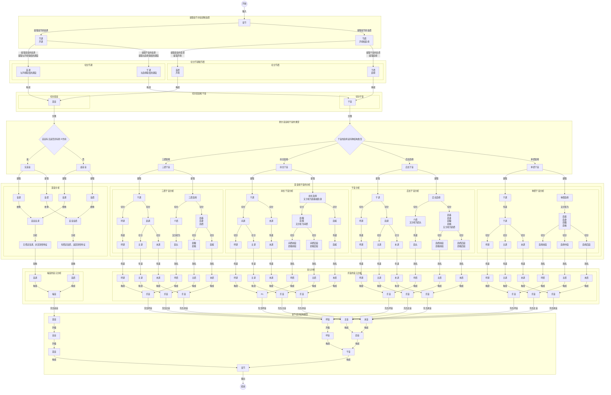

```mermaid
graph TB
    Start((开始)) --> |输入|A[音节]
    subgraph 提取音节的音调和音质["提取音节的音调和音质"]
        A --> |提取音节的音调|B[节调<br>声调]
        A --> |提取音节的音质|C[节质<br>声母和韵母]
    end

    subgraph 切分节调和节质["切分节调和节质"]
        subgraph 切分节调["切分节调"]
        B --> |提取首音的音调<br>提取与声母联结的调段|D1[首调<br>与声母联结的调段]
        B --> |提取干音的音调<br>提取与韵母联结的调段|D2[干调<br>与韵母联结的调段]
        end
        subgraph 切分节质["切分节质"]
        C --> |提取首音的音质<br>提取声母|E1[首质<br>声母]
        C --> |提取干音的音质<br>提取韵母|E2[干质<br>韵母]
        end
    end

    subgraph 切分首音和干音["切分首音和干音"]
        subgraph 切分首音["切分首音"]
            D1 --> |构成|F[首音]
            E1 --> |构成|F
        end
        subgraph 切分干音["切分干音"]
            D2 --> |构成|G[干音]
            E2 --> |构成|G
        end
    end

    subgraph 划分首音和干音的类型["划分首音和干音的类型"]
        F --> |分类|F1{首音有无是否具有辨义作用}
        F1 --> |是|H1[实首音]
        F1 --> |否|H2[虚首音]
        G --> |分类|F2{干音的韵母是何种结构类型}
        F2 --> |三质韵母|G1[三质干音]
        F2 --> |前长韵母|G2[前长干音]
        F2 --> |后长韵母|G3[后长干音]
        F2 --> |单质韵母|G4[单质干音]
    end

    subgraph 首音和干音的分析["首音和干音的分析"]
        subgraph 首音分析["首音分析"]
            H1 --> |提取|H3[音调]
            H1 --> |提取|H4[音质]
            H2 --> |提取|H5[音调]
            H2 --> |提取|H6[音质]
            H3 --> |统称|H7[首音音调]
            H5 --> |统称|H7
            H4 --> |统称|H8[首音音质]
            H6 --> |统称|H8
            H7 --> |分析|H9[无稳定音调、非区别性特征]
            H8 --> |分析|H10[有稳定音质、是区别性特征]
        end
        subgraph 干音分析["干音分析"]
            subgraph 单质["单质干音分析"]
            G4 --> |提取|J1[干调]
            G4 --> |提取|J2[单质韵母]
            J2 --> |又分析为|J3[韵基<br>韵身<br>韵腹<br>韵核]
            J3 --> |切分|J4[韵母前段]
            J3 --> |切分|J5[韵母中段]
            J3 --> |切分|J6[韵母后段]

            J1 --> |传递|J7[干调]
            J7 --> |切分|J8[呼调]
            J7 --> |切分|J9[主调]
            J7 --> |切分|J10[末调]
            end

            subgraph 后长["后长干音分析"]
            G3 --> |提取|K1[干调]
            G3 --> |提取|K2[后长韵母]

            K2 --> |切分|K3[介质<br>又分析为韵头]
            K2 --> |切分|K4[韵基<br>韵身<br>韵腹<br>韵核<br>又分析为韵质]
            K3 --> |传递|K5[韵头]
            K4 --> |切分|K6[韵质前段<br>韵核前段]
            K4 --> |切分|K7[韵质后段<br>韵核后段]

            K1 --> |切分|K8[呼调]
            K1 --> |切分|K9[韵调]
            K8 --> |传递|K10[呼调]
            K9 --> |切分|K11[主调]
            K9 --> |切分|K12[末调]

            end
            subgraph 前长["前长干音分析"]
            G2 --> |提取|L1[干调]
            G2 --> |提取|L2[前长韵母<br>又分析为韵基或韵身]

            L2 --> |切分|L3[韵腹<br>韵核<br>又分析为间质]
            L2 --> |切分|L4[韵尾]
            L1 --> |切分|L5[间调]
            L1 --> |切分|L6[末调]

            L3 --> |切分|L7[间质前段<br>韵核前段]
            L3 --> |切分|L8[间质后段<br>韵核后段]
            L4 --> |传递|L9[韵尾]

            L5 --> |切分|L10[呼调]
            L5 --> |切分|L11[主调]
            L6 --> |传递|L12[末调]
            end

            subgraph 三质["三质干音分析"]
            G1 --> |提取|M1[干调]
            G1 --> |提取|M2[三质韵母]

            M1 --> |切分|M3[呼调]
            M1 --> |切分|M4[韵调]

            M3 --> |传递|M5[呼调]
            M4 --> |切分|M6[主调]
            M4 --> |切分|M7[末调]

            M2 --> |切分|M8[介质]
            M2 --> |切分|M9[韵基<br>韵身<br>韵质]
            M8 --> |又分析为|M10[韵头]
            M9 --> |切分|M11[韵腹<br>韵核]
            M9 --> |切分|M12[韵尾]
            end
        end
    end

    H9 --> |简称|H11[首调]
    H10 --> |简称|H12[首质]

    J8 --> |传递|J11[呼调]
    J9 --> |传递|J12[主调]
    J10 --> |传递|J13[末调]
    J4 --> |改名|J14[呼质]
    J5 --> |改名|J15[主质]
    J6 --> |改名|J16[末质]

    K10 --> |传递|K13[呼调]
    K11 --> |传递|K14[主调]
    K12 --> |传递|K15[末调]
    K5 --> |改名|K16[呼质]
    K6 --> |改名|K17[主质]
    K7 --> |改名|K18[末质]

    L10 --> |传递|L13[呼调]
    L11 --> |传递|L14[主调]
    L12 --> |传递|L15[末调]
    L7 --> |改名|L16[呼质]
    L8 --> |改名|L17[主质]
    L9 --> |改名|L18[末质]

    M5 --> |传递|M13[呼调]
    M6 --> |传递|M14[主调]
    M7 --> |传递|M15[末调]
    M10 --> |改名|M16[呼质]
    M11 --> |改名|M17[主质]
    M12 --> |改名|M18[末质]

    subgraph 音元分析["音元分析"]
        subgraph 噪音["噪音的音元分析"]
            H11 --> |构成|N1[噪音]
            H12 --> |构成|N1
        end
        subgraph 乐音["乐音的音元分析"]
            J11 --> |构成|N2[乐音]
            J14 --> |构成|N2
            J12 --> |构成|N3[乐音]
            J15 --> |构成|N3
            J13 --> |构成|N4[乐音]
            J16 --> |构成|N4

            K13 --> |构成|O1[乐音]
            K16 --> |构成|O1
            K14 --> |构成|O2[乐音]
            K17 --> |构成|O2
            K15 --> |构成|O3[乐音]
            K18 --> |构成|O3

            L13 --> |构成|P1
            L16 --> |构成|P1
            L14 --> |构成|P2[乐音]
            L17 --> |构成|P2
            L15 --> |构成|P3[乐音]
            L18 --> |构成|P3

            M13 --> |构成|Q1[乐音]
            M16 --> |构成|Q1
            M14 --> |构成|Q2[乐音]
            M17 --> |构成|Q2
            M15 --> |构成|Q3[乐音]
            M18 --> |构成|Q3
        end
    end

    subgraph 音节层次结构模型["音节层次结构模型"]
        N1 --> |充当首音|R1[首音]
        N2 --> |充当呼音|R2[呼音]
        N3 --> |充当主音|R3[主音]
        N4 --> |充当末音|R4[末音]

        O1 --> |充当呼音|R2
        O2 --> |充当主音|R3
        O3 --> |充当末音|R4

        P1 --> |充当呼音|R2
        P2 --> |充当主音|R3
        P3 --> |充当末音|R4

        Q1 --> |充当呼音|R2
        Q2 --> |充当主音|R3
        Q3 --> |充当末音|R4

        R1 --> |升级|S1[首音]
        R2 --> |升级|S2[呼音]
        R3 --> |构成|S3[韵音]
        R4 --> |构成|S3

        S1 --> |升级|T1[首音]
        S2 --> |构成|T2[干音]
        S3 --> |构成|T2

        T1 --> |构成|U1[音节]
        T2 --> |构成|U1
    end
    U1 --> |输出|End((结束))
```
